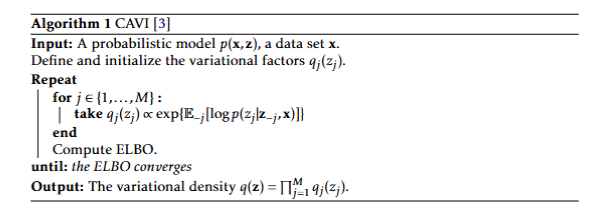

# Coordinate Ascent Variational Inference (CAVI) for a Gaussian Mixture Model (GMM)

This repository presents a pure numpy implementation of the Coordinate Ascent Variational Inference (CAVI) algorithm for a Bayesian Gaussian Mixture Model (GMM). This work was developed as a core component of my undergraduate final thesis, titled **Probabilistic Machine Learning. The Variational Autoencoder**.

The project's centerpiece is a Jupyter notebook that provides a step-by-step walkthrough of the CAVI algorithm. It includes the derivation of the update rules and visualizes the results of applying the model to a synthetic dataset. The primary goal is to demonstrate how variational inference can be used to efficiently approximate the intractable posterior distribution of latent variables within a GMM, serving as a practical example of its application in probabilistic graphical models.

For a comprehensive understanding of the theoretical foundations and the detailed derivations, please refer to the accompanying PDF document, which can be found at the root of this project. Chapters 2, and specifically Section 2.4, provide the necessary background to fully grasp the implementation and Variational Inference itself.

### 1. Introduction to Variational Inference and CAVI

Variational Inference (VI) is a powerful technique for approximating complex probability distributions, particularly in the context of Bayesian inference. It transforms the problem of inference, which is often intractable, into an optimization problem by searching for the best approximation $q(\mathbf{z})$ from a family of distributions $\mathcal{F}$ to the true posterior distribution $p(\mathbf{z}|\mathbf{x})$ in a probabilistic model defined by its prior distribution $p(\textbf{z})$ and likelihood $p(\textbf{x}|\textbf{z})$.

The goal is to minimize the Kullback-Leibler (KL) divergence between the approximate distribution $q(\mathbf{z})$ and the true posterior $p(\mathbf{z}|\mathbf{x})$:

$$
q^*(\mathbf{z}) = \underset{\substack{q(\mathbf{z}) \in \mathcal{F}}}{\mathrm{argmin}} \quad KL(q(\mathbf{z})||p(\mathbf{z}|\mathbf{x})).
$$

Minimizing the KL divergence is equivalent to maximizing the Evidence Lower Bound (ELBO), which is the objective function we optimize in this project. The **Coordinate Ascent Variational Inference (CAVI)** algorithm is used to iteratively update the parameters of $q(\mathbf{z})$ to maximize the ELBO given the assumption that the variational distribution can be factorized into independent components:

$$
    q(\mathbf{z}) = \prod_{i=1}^{K} q_i(\mathbf{z}_i),
$$

allowing for efficient computation even in high-dimensional spaces. 

Given this factorization, for any probabilistic model with latent variables $\{z_j\}_{j = 1}^M$, it can be proved (refer to Theorem 2.2 in the PDF document) that the optimal iterative update for each component $q_j(\mathbf{z}_j)$ is the one shown in the following algorithm:

  

### 2. Model and Implementation Overview

This project implements a **Gaussian Mixture Model (GMM)** using **Variational Inference (VI)** to perform approximate Bayesian inference. The model consists of $K$ two-dimensional Gaussian components, each with its own mean $\boldsymbol{\mu}_k$, and a common identity covariance matrix. The latent variables are the means of the components and a categorical indicator vector $\textbf{c}_i$ that assigns each data point $\textbf{x}_i$ to a specific cluster.

  

The model's joint distribution is defined by the following likelihood and prior distributions:
* **Prior for Means:** Each mean is drawn from an isotropic normal distribution: $\boldsymbol{\mu}_k \sim \mathcal{N}(\textbf{0}, \sigma^2\textbf{I})$.
* **Prior for Cluster Assignments:** Each data point is assigned to a cluster with equal probability: $\textbf{c}_i \sim Cat(\frac{1}{K}, \dots, \frac{1}{K})$.
* **Likelihood:** Each data point is generated from the mean of its assigned cluster: $\textbf{x}_i | \textbf{c}_i, \boldsymbol{\mu} \sim \mathcal{N}(\boldsymbol{\mu}_{c_i}, \textbf{I})$.

The main challenge is that the posterior distribution of the latent variables is analytically intractable. To solve this, we use the **Coordinate Ascent Variational Inference (CAVI)** algorithm to find an approximate distribution $q(\boldsymbol{\mu}, \textbf{c})$ that best fits the true posterior. We assume a mean-field variational family where the approximate posterior factorizes as $q(\boldsymbol{\mu}, \textbf{c}) = \prod_{k = 1}^K q(\boldsymbol{\mu}_k) \prod_{i = 1}^N q(\textbf{c}_i)$, using normal and categorical distributions for the means and cluster assignments, respectively:

$$
    q(\boldsymbol{\mu}_k;\textbf{m}_k,s_k^2) \sim \mathcal{N}(\textbf{m}_k, s_k^2 \textbf{I}), \quad \quad k = 1, \dots, K,
$$
$$
    q(\textbf{c}_i; \boldsymbol{\varphi}_i) \sim Cat(\boldsymbol{\varphi}_i), \quad \quad i = 1, \dots, N,
$$

where $s_k^2 \in \mathbb{R}^+, \textbf{m}_k \in \mathbb{R}^2$ and $\boldsymbol{\varphi}_i \in \mathbb{R}^K$.

The CAVI algorithm iteratively updates the parameters of the variational distributions by maximizing the **Evidence Lower Bound (ELBO)**. We derive and implement the update rules for the variational parameters of both the cluster means ($\textbf{m}_k, s_k^2$) and the cluster assignment probabilities ($\boldsymbol{\varphi}_i$).

Using the CAVI algorithm updates we can obtain the update rules (refer to the PDF document for their derivation). The optimal update for the assignments probabilities $\boldsymbol{\varphi}_i$ are given by:

$$
    \varphi_{i}^{(k)} = \frac{\exp \{-\frac{1}{2}||\textbf{x}_i - \textbf{m}_k||^2 - \frac{1}{2}s_k^2\}}{\sum_{j = 1}^K \exp \{-\frac{1}{2}||\textbf{x}_i - \textbf{m}_j||^2 - \frac{1}{2}s_j^2\}},
$$

where $\varphi_{i}^{(k)}$ is the k-th component of $\varphi_{i}$ given $i \in \{1, \dots, N\}$ and $k \in \{1, \dots, K\}$.

The update rules for the means $\textbf{m}_k$ and variances $s_k^2$ are given by:

$$
    \textbf{m}_k = \frac{\sum_i \varphi_{i}^{(k)}\textbf{x}_i}{\frac{1}{\sigma^2} + \sum_i \varphi_{i}^{(k)}} \quad ;\quad s_k^2 = \frac{1}{\frac{1}{\sigma^2} + \sum_i \varphi_{i}^{(k)}}.
$$

### 3. Results

To test the implementation, the algorithm was applied to a synthetic dataset of 500 points generated from 4 Gaussian clusters. This implementation can be seen in `VI_mixture.ipynb`

  

The yellow points represent the randomly initialized means of the clusters, the data points are colored according to their true cluster assignments where the true cluster centroids are clearly visible.

Now, we run the CAVI algorithm for 50 iterations. The approximate posterior distribution that the algorithm learns will not only provide the centroids of each cluster and indicate the cluster assignments for each data point, but also provide a generative model that can be used to sample new data points from the learned distribution for each cluster.

  
  

The results demonstrate that the CAVI algorithm successfully converges, with the learned variational parameters closely matching the expected values:

* **Learned Means:** The variational means $\textbf{m}_k$ accurately converge to the true centroids of the clusters.
* **Variances:** The variances $s_k^2$ converge to very small values, indicating high confidence in the estimated cluster means.
* **Cluster Assignments:** The probabilities $\boldsymbol{\varphi}_i$ for each data point correctly assign it to a single cluster with very high probability close to 1 for datapoints at the true centroid.

The project also includes a monitoring of the ELBO for 10 different random initializations, which confirms the algorithm's fast convergence, while also highlighting the presence of local minima.

